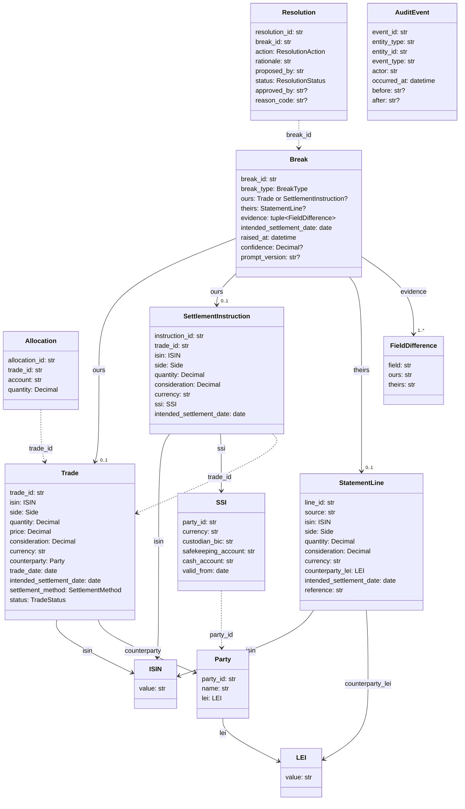
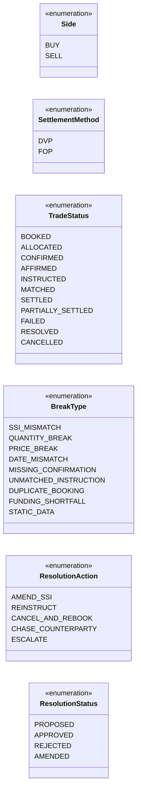
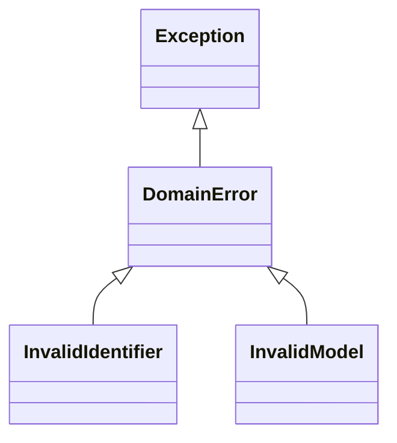

# Domain model

Class diagrams for `src/settlement/domain/`, the target design for SE-04.

**How to read the diagrams**

| Symbol | Meaning |
|---|---|
| Solid arrow `──▶` | The model **holds** the other object inside it (e.g. a `Trade` holds a `Party`) |
| Dotted arrow `┄┄▶` | The model **points to** another model by its id only (e.g. `Allocation.trade_id`) |
| Hollow triangle `──▷` | **Is a kind of** (inheritance) |
| `?` after a type | May be empty (`None`) |
| `"1..*"` | One or more |

---

## 1. Models and how they connect

**In words:**

- **Reference data:** a `Party` is a company we trade with, identified by its `LEI`. An `SSI` holds that party's bank and account details for one currency.
- **Our side:** a `Trade` is what we booked. `Allocation`s split it across client accounts. A `SettlementInstruction` tells the custodian how to settle it, using an `SSI`.
- **Their side:** a `StatementLine` is what the custodian says happened.
- **The problem:** a `Break` compares our side (`ours`) with their side (`theirs`). Its `evidence` lists every `FieldDifference`, meaning each field where the two disagree. A `Break` without evidence can't be created.
- **The fix:** a `Resolution` proposes an action for one `Break`, and a human approves or rejects it.
- **The record:** an `AuditEvent` records any change to any model. `entity_type` and `entity_id` say which one, so it isn't linked to a single class in the diagram.

---

## 2. Enums: the fixed lists of allowed values

| Enum | Used by |
|---|---|
| `Side` | `Trade`, `SettlementInstruction`, `StatementLine` |
| `SettlementMethod` | `Trade` |
| `TradeStatus` | `Trade` (changed only by `lifecycle.py`, SE-05) |
| `BreakType` | `Break` |
| `ResolutionAction` | `Resolution` |
| `ResolutionStatus` | `Resolution` |

---

## 3. Errors

- `InvalidIdentifier` is raised by `ISIN` and `LEI` when the format or check digit is wrong.
- `InvalidModel` is raised by every other model when one of its rules is broken (a float quantity, an empty evidence list, a naive datetime and so on).
- `except DomainError` catches both.
